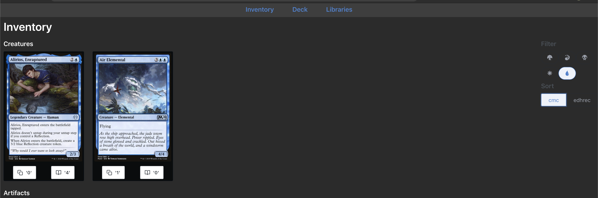
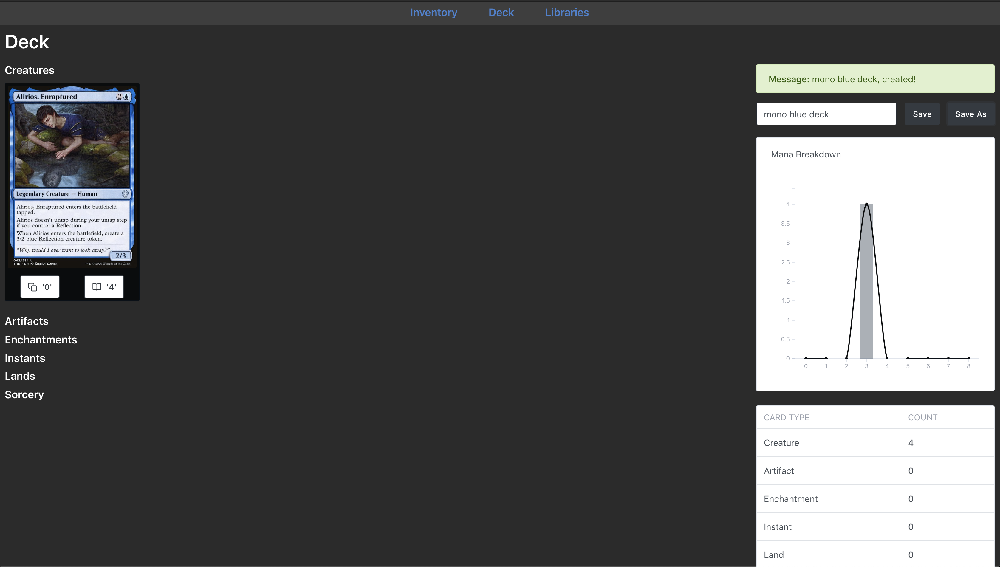
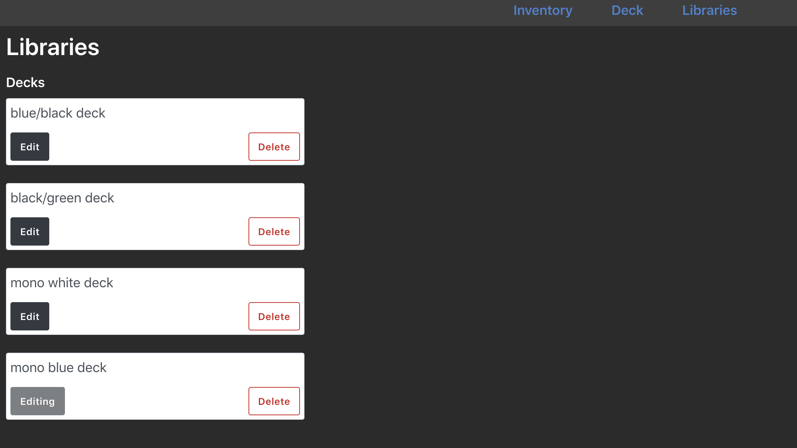

# MTG Inventory

## Inventory

Manage cards from inventory screen



## Deck

Analyse deck composition



## Libraries

Store multiple decks



## Jupyter Lab

```
pip install -r requirements-data.txt
jupyter lab
```

## Update data and start backend

```bash
# After exporting card to data/inventory.csv
python scripts/create_card_list.py

# Then gather data from scryfall
python scripts/gather_scryfall_data.py

# Construct dataset
python scripts/create_dataset.py

# Create DB
flask db upgrade

# Have a default deck
curl -XPOST localhost:4000/api/v1/deck \
    -H 'Content-Type: application/json' \
    -d '{"name": "B/W Deck", "items": []}'

# Run server
python app.py

# Populate inventory
python scripts/populate_inventory.py
```

### Starting the frontend

```
npm start
```

## ScryFall API

```bash
curl https://api.scryfall.com/cards/named?exact=deathless+knight
```

Peculiar Card Names:

```
# Solve with %27
Yarok's Fenlurker

# Solve with %2C
"Yorvo, Lord of Garenbrig"A

# Solve with %2f
Ardenvale Tactician // Dizzying Swoop
```
